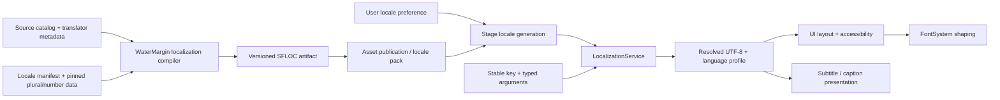

# Localization System Design

| Field | Value |
| --- | --- |
| Status | Phases 1 and 2 implemented; production content and application UI wiring remain planned |
| Scope | Game text catalogs, locale selection, message formatting, language profiles, subtitles, and translation workflow |
| Owner | WaterMargin with game-owned offline tooling |
| Runtime language | C# gameplay/application layer with copy-only Engine boundaries |
| Initial content format | Versioned UTF-8 source catalogs compiled to bounded binary artifacts |
| Last updated | 2026-09-05 |

## Summary

SpriteForge localization will turn stable game message keys and typed arguments
into resolved UTF-8 presentation text for UI, subtitles, accessibility, and
other player-facing copy. It owns locale selection, explicit fallback chains,
plural and select rules, number formatting, catalog compatibility, translation
validation, pseudo-localization, and hot reload.

Localization is game-owned because its keys, grammar, factions, units,
campaign concepts, and release languages are product content. `Engine/Text`
shapes and draws the resulting text, `Engine/UI` lays it out and exposes
semantics, and the generic asset system may transport compiled catalog bytes.
None of those engine modules understands localization keys, plural rules, or
the meaning of a regiment name.

`Source/WaterMargin.App/` contains a Windows-only .NET 10 WPF
sprite-rendering prototype, not the colony-sandbox application. Phases 1 and 2
provide a separate WaterMargin-owned .NET 10
runtime, strict source compiler, deterministic typed catalog artifacts, SFMF
formatting, pinned number/plural profiles, `en-US` sample content,
pseudo-locales, and a compile-only test target. Resolved messages carry a
copy-only language profile suitable for a future UI/Text adapter. The WPF
example does not yet select a locale or display localized UI. Persisted
preferences, shipping translation packs, application UI wiring, and production
RTL support remain planned.

## Related contracts

| Area | Authority |
| --- | --- |
| Product ownership and sandbox direction | [Product vision](../Product/Vision.md) |
| UI layout, actions, semantics, and managed boundary | [SpriteForge UI system](https://github.com/pony155/SpriteForge/blob/main/Engine/Docs/UISystem.md) |
| Unicode shaping, font fallback, glyph coverage, and bidi limits | [SpriteForge font system](https://github.com/pony155/SpriteForge/blob/main/Engine/Docs/FontSystem.md) |
| Stable asset identity and transactional publication | [SpriteForge asset system](https://github.com/pony155/SpriteForge/blob/main/Engine/Docs/AssetSystem.md) |
| Deterministic simulation and replay commands | [SpriteForge command system](https://github.com/pony155/SpriteForge/blob/main/Engine/Docs/CommandSystem.md) |
| Application lifecycle and service ordering | [SpriteForge framework](https://github.com/pony155/SpriteForge/blob/main/Engine/Docs/Frameworkd.md) |
| Dialogue, UI, and accessibility audio routing | [SpriteForge audio system](https://github.com/pony155/SpriteForge/blob/main/Engine/Docs/AudioSystem.md) |

## Goals

- Address every authored message through a stable collision-checked key.
- Compile translator-facing UTF-8 sources into deterministic, bounded runtime
  artifacts; do not parse message syntax during normal gameplay.
- Support typed placeholders, cardinal/ordinal plural selection, exact-number
  cases, generic select cases, and locale-aware number formatting.
- Validate every translation against the source message's placeholder schema.
- Make locale fallback explicit, acyclic, deterministic, and observable.
- Publish locale changes atomically so one visible frame does not mix old and
  new language generations unexpectedly.
- Keep localized strings out of gameplay identity, save compatibility,
  simulation ordering, networking, and replay authority.
- Pass explicit BCP-47 language, text direction, and ordered project-font
  profiles to the FontSystem/UI boundary.
- Support pseudo-locales, expansion testing, missing-key reports, font-coverage
  reports, screenshots, and translator context.
- Treat accessibility names, descriptions, subtitles, and captions as first-
  class localized content rather than reconstructing them from visuals.
- Bound catalogs, keys, message programs, arguments, output, fallback depth,
  cache memory, per-frame formatting, and diagnostics.
- Permit locale packs and optional content namespaces without allowing silent
  incompatible overrides.

## Non-goals

The first implementation will not provide:

- Machine translation or automatic generation of shipping copy.
- A general scripting language, reflection evaluator, HTML renderer, or
  arbitrary ICU MessageFormat compatibility.
- Runtime parsing of translator source files.
- Automatic grammatical inflection of arbitrary names. The game supplies
  explicit grammatical attributes or a fully authored alternative message.
- Implicit lookup through the operating system's current culture, collation,
  installed fonts, regional calendar, or timezone.
- Translating player-authored names, save names, usernames, or chat. Those are
  data inserted into localized templates under explicit bidi/safety policy.
- Using translated display names as stable IDs, asset names, command names,
  sort keys for simulation, or serialization fields.
- Complete right-to-left UI or international text editing before the
  FontSystem/UI/Input prerequisites are complete.
- Shipping locale-sensitive currency, real-world date, or timezone formatting
  without a concrete game requirement and pinned data contract.
- Concatenating independently translated fragments to construct sentences.
- Treating a localized voice track and a subtitle as the same asset or assuming
  their timing is interchangeable.

## Design principles

1. **Keys are identity; text is presentation.** Code, saves, commands, and data
   retain stable keys or domain IDs. Resolved strings may change at any frame.
2. **Whole messages, not sentence fragments.** Translators control word order,
   punctuation, agreement, and placement of typed arguments.
3. **The source schema is authoritative.** Every locale implements the same
   argument names/types and required selection structure as the source entry.
4. **Compile complexity offline.** Source syntax becomes a validated bounded
   message program. Runtime execution has no parser, loops, or recursion.
5. **Fallback is explicit data.** A locale manifest names its ordered parents;
   runtime never guesses by stripping subtags or consulting host culture.
6. **Language profiles travel together.** Catalog, plural/number data,
   direction, project fonts, font features, and punctuation policy form one
   validated locale generation.
7. **Missing content is visible.** Development uses conspicuous markers and
   diagnostics. Shipping profiles cannot silently publish incomplete required
   base content.
8. **Locale cannot alter simulation.** Formatting, glyph availability,
   collation, and translated text never change deterministic outcomes.
9. **Bound every hostile input.** Catalogs, message programs, arguments, nested
   selects, output, and diagnostics have explicit limits.
10. **Preserve translator intent.** Message text is validated UTF-8 but is not
    silently normalized, re-punctuated, line-wrapped, or case-converted.

## Ownership and module boundaries

### `Source/WaterMargin.Localization`

The planned Game runtime owns:

- `LocalizationKey`, locale IDs, and canonical tag validation;
- loaded catalog generations and explicit fallback resolution;
- typed argument validation and message-program execution;
- pinned plural, number, and display-name data;
- locale selection, staged switching, and preference persistence;
- resolved-message caches and diagnostics;
- language/font profiles passed to UI/Text;
- subtitle/caption text resolution; and
- namespace/pack compatibility policy.

It does not own glyph shaping, UI layout, renderer resources, audio playback,
gameplay entities, or editor documents.

### Game-owned offline tooling

The first compiler belongs under `Tools/WaterMargin.Localization.Compiler`
because there is not yet a second credible product requiring a generic engine
localization service.
It may reuse engine UTF-8, hashing, artifact, and bounded-reader utilities, but
`Engine` must not depend on it.

If a later tool/editor needs the same product-independent compiler, the parser
and artifact validator may move into a focused Tools library. Game key sets,
locale manifests, translation policy, and content remain under `Game`.

### Engine boundaries

- `Engine/Assets` may load and version opaque compiled catalog artifacts after
  a deliberate asset type/loader is added. It does not resolve messages.
- `Engine/Text` receives resolved UTF-8, BCP-47 language, direction, font
  instances, and features. It never receives localization keys.
- `Engine/UI` receives resolved text plus style/semantic data. UI prefabs may
  store Game-owned localization keys only through an application adapter.
- `Engine/Audio` plays selected voice assets and exposes the UserInterface bus.
  Game owns language-specific voice/subtitle association.
- Framework orders initialization and atomic publication but contains no
  catalogs or game keys.

### Game systems

Game features pass stable domain IDs and typed values into localization. For
example, a work-status message owns colonist, job, resource, and reason IDs;
presentation resolves their display names and formats one complete message. No
simulation component stores the resulting sentence.

## Implemented layout

```text
WaterMargin/
├── Docs/
│   └── Architecture/
│       └── Localization.md
├── Source/
│   └── WaterMargin.Localization/
│       ├── Catalog/
│       │   ├── LocalizationCatalog.cs
│       │   ├── LocalizationIdentity.cs
│       │   ├── LocalizationLimits.cs
│       │   └── LocalizationTypes.cs
│       ├── Formatting/
│       │   ├── MessageFormatter.cs
│       │   └── MessageProgram.cs
│       ├── LocaleData/
│       │   └── PinnedLocaleData.cs
│       ├── LocalizationService.cs
│       └── WaterMargin.Localization.csproj
├── Tools/
│   └── WaterMargin.Localization.Compiler/
│       ├── MessageParser.cs
│       ├── SourceCatalogCompiler.cs
│       └── WaterMargin.Localization.Compiler.csproj
├── Tests/
│   └── WaterMargin.Localization.Tests/
│       └── WaterMargin.Localization.Tests.csproj
└── Content/
    └── Localization/
        ├── LocaleData/
        │   └── cldr-48.2.0-phase2.json
        └── en-US/
            └── core.sfloc.json
```

Add no empty runtime/tool directories or targets before their phase is
implemented with tests and documentation.

## Architecture



Compiler and runtime use the same artifact reader and message-program
validator. The runtime does not accept a source message string as executable
format syntax.

## Locale identity and manifests

### Locale IDs

Locale names are canonical validated BCP-47 tags such as `en-US`, `fr-FR`,
`ja-JP`, or `zh-Hant-TW`. Canonicalization occurs offline against a pinned
language-tag data version; runtime compares stored canonical ASCII bytes and a
stable hash. Invalid, duplicate, deprecated-without-migration, and hash-
colliding tags are rejected.

The service never reads process culture implicitly. Startup receives an
explicit requested locale from user settings or application configuration.
Platform locale detection may suggest a value only when creating first-run
settings and is stored after user/application policy resolves it.

### Locale manifest

Each shipping locale has one manifest containing:

- canonical locale tag, a bounded UTF-8 self-display name available before
  catalog loading, and an optional key describing it in the active locale;
- explicit ordered fallback locale tags;
- left-to-right or right-to-left base direction;
- pinned plural/number data version and rule-set IDs;
- decimal/group symbols and grouping patterns used by supported formats;
- ordered font-profile asset IDs and optional script-specific overrides;
- catalog namespaces included by the build/profile;
- optional voice/subtitle pack IDs; and
- compatibility range for game/content and localization artifact versions.

Fallback graphs must be acyclic, unique, bounded, and end in the configured
source locale. For example, `zh-Hant-TW` may explicitly fall back to `zh-Hant`
then `en-US`; the runtime does not invent that chain by removing subtags.

### Source and pseudo locales

One source locale defines required keys, descriptions, and argument schemas.
The exact source locale remains a product decision, but every shipping build
contains it as the final fallback.

Development builds include deterministic pseudo-locales:

- accented/expanded text to expose hard-coded widths and missing glyphs;
- a right-to-left stress profile that wraps messages in direction controls only
  when the FontSystem supports the required bidi behavior; and
- a key-echo mode that displays canonical keys for source tracing.

Pseudo transformation preserves placeholders and control structure. It never
ships as an automatically selectable player locale.

## Message keys and namespaces

Keys use lowercase ASCII dotted segments, for example:

```text
ui.campaign.end-turn
battle.order.move.confirmed
battle.casualties.summary
faction.empire.display-name
accessibility.battle.morale-meter
subtitle.intro.scene-01.line-003
```

Keys have a bounded canonical byte length and are stored as both full names and
stable 64-bit IDs. Registries/artifacts compare both, so a hash collision fails
instead of resolving the wrong text. Renames use explicit source aliases during
migration; new artifacts always write the current key.

The first segment declares a reviewed namespace. Base game, optional campaign,
DLC, mod, subtitle, and accessibility catalogs receive separate namespaces and
budgets. A pack may add keys in its namespace. It may override a base key only
when its manifest has explicit override permission and matches the source
argument schema and compatibility fingerprint.

Keys are not generated from English text. They describe stable meaning, not
screen position or current wording. Reusing one key for sentences with
different context is invalid even if the source text happens to match.

## Translator source catalog

The proposed source extension is `.sfloc.json`. JSON reuses the repository's
bounded duplicate-rejecting parser while the message expression is compiled by
a focused localization parser. An illustrative entry is:

```json
{
  "schemaVersion": 1,
  "locale": "en-US",
  "namespace": "battle",
  "messages": {
    "battle.casualties.summary": {
      "description": "Post-battle surviving and lost soldiers.",
      "arguments": {
        "survivors": "integer",
        "lost": "integer"
      },
      "message": "{survivors, number} survived; {lost, plural, one {# soldier was lost} other {# soldiers were lost}}."
    }
  }
}
```

Descriptions, screenshots, character limits, speaker, tone, and source
references are translator metadata. They may be excluded from shipping
artifacts but participate in source/tool hashes and reports.

The compiler rejects malformed UTF-8, duplicate JSON members, unknown fields
under strict schema mode, invalid keys/tags, oversized text, invalid escapes,
unsupported message constructs, argument mismatches, missing `other` cases,
excessive nesting, and trailing data. Message text bytes are preserved after
JSON escape decoding; no silent Unicode normalization occurs.

Source control stores one deterministic canonical organization per namespace.
Tool integrations may import/export a translation-management format, but the
reviewed `.sfloc.json` files remain the authored repository truth.

## SpriteForge Message Format

SpriteForge Message Format (SFMF) is a deliberately bounded ICU-inspired
subset. It is not advertised as complete ICU MessageFormat compatibility.

Phase 1 accepts literal/static text only and reserves braces for the message
compiler. Phase 2 adds simple typed substitution:

```text
{name}
{count, number}
{ratio, percent}
```

Phase 2 also adds selections:

```text
{count, plural, =0 {No units} one {# unit} other {# units}}
{position, select, attacker {Attacker} defender {Defender} other {Unknown}}
```

Rules are:

- arguments are declared by name and type in the source schema;
- translations use exactly the declared argument set unless an argument is
  explicitly optional;
- `plural` accepts signed integer or fixed-decimal values, tests exact `=n`
  cases first, then uses the locale's pinned cardinal category;
- ordinal selection is a distinct `selectordinal` operator;
- `#` is valid only inside plural branches and formats the selected number;
- every select/plural has `other`; locale-required categories are validated by
  tooling and may fall back to `other` only under explicit policy;
- nesting, branch count, literal bytes, arguments, and output are bounded;
- no loops, property access, functions, reflection, or program-defined
  recursion exist; explicitly nested `localizable` arguments use a bounded,
  cycle-checked call depth; and
- apostrophe/brace escaping is defined by SFMF and tested with golden fixtures,
  not inherited accidentally from a host library.

The implemented escaping contract uses `''` for one literal apostrophe and a
single apostrophe pair to quote a literal region, including braces or `#`.
Unmatched apostrophes and braces are compiler errors. Inserted text is never
reparsed under these rules.

Messages are compiled to an immutable validated instruction tree or bytecode.
Each instruction has fixed-width operands and checked offsets. Runtime execution
uses a bounded stack and writer; malformed programs fail before publication.

Rich presentation markup is deferred. A later version may support a small set
of named semantic spans such as `emphasis` or `unit-name`, compiled into text
and style ranges. It will not accept HTML/CSS, arbitrary tags, assets, links, or
callbacks. Accessibility output retains the text meaning without visual tags.

## Typed arguments

Runtime callers pass a bounded ordered set of values matched by argument ID:

| Type | Meaning |
| --- | --- |
| `integer` / `unsigned` | Exact 64-bit whole number |
| `fixed` | Signed scaled integer plus declared decimal scale |
| `percent` | Fixed value formatted as a percentage |
| `text` | Validated bounded UTF-8 presentation data |
| `select` | Canonical ASCII token from an entry's allow-list |
| `boolean` | Explicit two-state selection input |
| `localizable` | Another key plus bounded arguments, with depth limit |

Binary floating-point is not a source of display semantics. Simulation values
are converted to a defined scaled integer/rounding policy before formatting.
Domain identifiers are resolved to their localized display-name key by Game
code; the formatter does not inspect ECS entities or asset objects.

Argument values never contain pointers, delegates, native handles, arbitrary
objects, format strings, or renderer resources. Missing, duplicate, unknown,
wrong-type, out-of-range, and excessive arguments return an actionable error
and leave the destination unchanged.

Player-authored text is inserted as opaque UTF-8, never reparsed as SFMF. The
argument schema marks it for direction isolation once the FontSystem supports
the required bidi controls. It is excluded from localization caches whose keys
or diagnostics might leak contents.

## Plural and number data

Plural categories and number symbols/grouping derive from pinned Unicode CLDR
48.2.0 data under the Unicode-3.0 license. The generated Phase 2 table is
bounded to `en`, `fr`, `ru`, and `ar`; those profiles support representative
tests and do not claim that non-English translations or production RTL UI ship.
The version and generated table hash are recorded in catalog artifacts,
resolved language profiles, diagnostics, and test fixtures. Builds never
download CLDR implicitly. See the checked-in
[`cldr-48.2.0-phase2.json`](../../Content/Localization/LocaleData/cldr-48.2.0-phase2.json)
and [Unicode data notice](../../Content/Localization/LocaleData/UNICODE-LICENSE-NOTICE.md).

Only the data required by shipping locale profiles is generated. Generated
tables are checked in or produced by an explicit offline step with recorded
license/attribution. Updating CLDR is a reviewed data migration with before/
after golden diffs, not a transparent SDK or operating-system change.

Initial numeric formats are decimal integer, bounded fixed decimal, and
percent. Each declares grouping, minimum/maximum fraction digits, and rounding.
Parsing localized numbers back into gameplay data is a separate validated input
operation and is not implied by formatting support.

Campaign calendars are game data rather than Gregorian host dates. Game code
supplies a localized key/arguments or a dedicated typed campaign-date formatter.
Real-world dates, times, currencies, units, and collation remain later features
requiring explicit rules and fixtures.

## Catalog artifact

The compiled `.sfloc` artifact uses a versioned little-endian envelope and
contains:

- magic, artifact schema, compiler identity, and full-content checksum;
- canonical locale/namespace plus their stable IDs and full names;
- game/content compatibility range and source-catalog fingerprint;
- pinned plural/number data version and hash;
- explicit fallback references and locale direction/profile metadata;
- key table sorted by `(keyId, canonicalName)`;
- source-schema fingerprints and typed argument tables;
- bounded message programs and shared literal storage; and
- required font/profile code-point inventory metadata.

It never serializes C# object layouts, dictionaries, pointers, delegates,
native handles, absolute paths, or runtime cache state. Readers validate every
offset, size, count, sort order, duplicate, hash, enum, program opcode, jump,
argument reference, and trailing byte before publishing any entry.

Equivalent source content, tool version, locale data, and settings produce
byte-identical artifacts. Source descriptions may be packaged separately for
developer/editor builds.

## Fallback and missing messages

Lookup walks the staged locale's explicit fallback chain in order. It records
the resolved locale for diagnostics but returns one immutable message program.
Fallback is per complete message; branches are never merged across locales.

Policy is profile-dependent:

| Condition | Development | Shipping |
| --- | --- | --- |
| Missing selected-locale key | Use fallback and record diagnostic | Use fallback and increment telemetry |
| Missing from complete chain | Show `[missing:key]` | Fail locale publication for required key |
| Invalid arguments/program | Show `[format:key]` and diagnostic | Return error; caller uses reviewed fallback copy |
| Optional pack absent | Mark namespace unavailable | Hide/disable feature through Game policy |

An explicitly empty translation is distinct from a missing key and is allowed
only when the source schema marks the entry as empty-capable. Required base
catalogs must be complete at build time. Feature/DLC manifests declare which
key sets become required when that content is enabled.

## Locale selection and atomic switching

`LocalizationService` stages a locale generation before making it visible:

1. Resolve the requested locale and its explicit fallback/catalog namespaces.
2. Load and validate all required catalog/profile artifacts and compatibility.
3. Validate source-schema fingerprints, required keys, font-profile references,
   and configured budgets.
4. Build immutable lookup indexes in staging storage.
5. Publish one new locale generation at the application/UI update boundary.
6. Notify Game/UI owners to replace resolved text and Text layouts by stable key.
7. Retire the old generation only after its borrowed formatting scope ends.

Failure leaves the old locale fully active. UI never observes a half-published
chain. Optional packs may arrive later only through another complete generation.

Locale preference belongs to user/application settings, not the deterministic
campaign save. A save may record the locale used for a screenshot or authored
note as metadata, but loading it never changes game rules or requires that
locale to be installed.

Switching locale invalidates formatted-message caches and UI text layouts, but
not gameplay state, stable element keys, commands, or save identities. Font
glyph preparation may finish later; layout metrics remain independent from GPU
atlas residency.

## Font and UI integration

Each locale profile supplies an ordered list of project font assets/instances,
language tag, base direction, optional script tag, OpenType features, and
punctuation/line-break policy. Resolved UI text carries that profile into
`TextStyle`; it does not ask the OS for a font.

Offline coverage reports compute the union of:

- all literal code points in the locale and its fallbacks;
- digits, signs, grouping/decimal/percent symbols;
- UI punctuation, replacement glyphs, and direction controls;
- known dynamic names/content inventories; and
- subtitle/caption characters in the build profile.

Font subsetting uses the union for every locale packaged together. User-authored
or mod text requires a full suitable fallback font because missing glyphs cannot
be recovered from platform fonts. Coverage failure for required content blocks
the locale build; optional unknown content uses a reviewed missing-glyph policy.

UI layouts assume translation expansion. Authors do not concatenate labels,
embed unexplained hard line breaks, or position text by source-language width.
Pseudo-locales and screenshots validate clipping, wrapping, focus order,
semantic names, and minimum touch/click targets.

Right-to-left messages and opposite-direction inserted names require Unicode
isolation and standards-complete bidi layout. Content is never manually
reversed. Until the FontSystem's bidi phase is complete, RTL locale profiles
may compile for diagnostics but cannot be marked production-supported.

## Accessibility, subtitles, and voice

Accessibility names, descriptions, state/value messages, tutorials, and input
prompts use ordinary localization keys with their own context. A visual label
may be reused as an accessible name only when the meaning and update cadence are
identical. Screen-reader text does not include decorative markup or abbreviate
information needed to understand state.

Subtitles are localized timed records containing stable cue ID, message key,
arguments or bound dialogue variables, start/end offsets, speaker identity, and
optional placement policy. Captions additionally describe meaningful
non-dialogue audio. Timing belongs to authored dialogue/cutscene data and is
validated against the selected audio asset; translators may request timing
overrides through explicit metadata.

Localized voice is an optional locale pack mapping stable dialogue cue IDs to
audio assets. Missing voice may fall back to the source voice or silence under
product policy while subtitles remain in the selected text locale. Text locale
and voice locale are distinct settings if the product exposes that choice.

Player-facing key/button names come from an input-glyph/input-label service,
not hard-coded localized strings that assume one keyboard or controller.

## Gameplay, saves, replay, and sorting

Simulation and persistence store stable faction, unit, character, command,
technology, building, and scenario IDs. Localization resolves their display
names only during presentation extraction.

Localized output must not affect:

- fixed-tick branches, random sampling, AI, morale, combat, or economy;
- command type/payload identity or replay byte streams;
- save compatibility or entity/component schemas;
- network validation or authoritative ordering; or
- resource lookup by translated name.

Default gameplay lists sort by stable game-defined fields and IDs. A screen may
offer locale-aware display-name sorting as an explicitly presentation-only
view. If implemented, collation uses pinned locale data and a stable ID
tie-breaker; selection/actions still carry stable item identity. Replay records
the selected item/command, never the localized sort key or clicked row index.

Logs and diagnostics use stable canonical IDs plus optional localized UI
presentation. Crash reports never rely on translation to identify an error.

## Runtime API shape

The intended C# boundary is illustrative:

```csharp
public readonly record struct LocalizationKey(ulong Value);
public readonly record struct LocaleId(ulong Value);

public enum LocalizationValueKind
{
    Integer,
    Unsigned,
    Fixed,
    Percent,
    Text,
    Select,
    Boolean,
    Localizable
}

public readonly struct LocalizationArgument
{
    public uint NameId { get; init; }
    public LocalizationValueKind Kind { get; init; }
    public long SignedValue { get; init; }
    public ulong UnsignedValue { get; init; }
    public int DecimalScale { get; init; }
    public string? TextValue { get; init; }
    public LocalizationKey NestedKey { get; init; }
}

public sealed class LocalizationService
{
    public LocalizationStatus Initialize(LocalizationConfig config);
    public LocalizationStatus StageLocale(
        LocaleId locale,
        ReadOnlySpan<LocalizationCatalog> catalogs,
        out LocaleGeneration generation);
    public LocalizationStatus PublishLocale(LocaleGeneration generation);

    public LocalizationStatus Format(
        LocalizationKey key,
        ReadOnlySpan<LocalizationArgument> arguments,
        out LocalizedMessage message);
    public LocalizationStatus GetStatic(
        LocalizationKey key,
        out LocalizedMessage message);

    public LocaleSnapshot GetLocaleSnapshot();
    public LocalizationDiagnostics GetDiagnostics();
    public void Shutdown();
}
```

`LocalizedMessage` owns its UTF-8 or managed string storage and copies language,
direction, source key, resolved locale, and generation. No caller retains a
pointer into catalog memory. Formatting either produces one complete message or
leaves output unchanged.

The service is owned by the application/UI lane. Immutable published catalogs
may be read concurrently only after the exact managed/native design proves
lifetime safety. Initial implementation remains single-owner-thread and uses no
hidden worker threads.

## Bounds and failure policy

Proposed defaults are starting points, not release promises:

| Resource/work | Proposed default | Failure behavior |
| --- | ---: | --- |
| Loaded locale generations | 2 | Stage rejects or retires unused old generation |
| Fallback depth | 8 | Reject locale manifest |
| Catalog namespaces per locale | 64 | Reject generation |
| Keys per locale | 100,000 | Reject artifact/generation |
| Canonical key bytes | 127 | Reject source/artifact |
| Arguments per message | 32 | Reject compilation/format call |
| Selection nesting | 8 | Reject compilation/artifact |
| Branches per selection | 64 | Reject compilation/artifact |
| Message program bytes | 64 KiB | Reject entry |
| Formatted message bytes | 256 KiB | Return `OutOfResource` with unchanged output |
| Formats per host frame | 4,096 | Defer noncritical presentation and report overflow |
| Static-message cache | 16 MiB | Deterministic bounded eviction |
| Diagnostic records | 1,024 | Drop oldest metadata-only record |

Shipping profiles may lower limits. Catalog size and font inventory are also
bounded by asset/package policy. Arithmetic overflow, invalid offsets, or bad
checksums are data corruption, not capacity exhaustion.

Failure behavior is explicit:

- malformed source is a compiler error with file/key/byte location;
- incompatible or corrupt artifacts fail staging and preserve the old locale;
- unknown key returns `ItemNotFound` plus missing-key policy;
- argument mismatch returns `InvalidArgument` without partial output;
- unsupported artifact/message/locale data returns `NotSupported`;
- configured limits return `OutOfResource`; and
- allocation failure returns `OutOfMemory` at the managed/native boundary.

## Caching and performance

Static messages with no arguments may be decoded once per locale generation and
stored in a bounded cache ordered by stable key. Dynamic messages are normally
formatted into caller/UI-owned storage. High-cardinality argument values such
as player names do not enter a global cache.

Optional dynamic caching requires a canonical typed-argument byte key, strict
entry/byte limits, exclusion of sensitive/user text, and stable eviction order.
It is added only after profiling demonstrates value.

Locale switch builds indexes once. Per-call lookup is by stable key with full-
name collision verification at catalog registration/debug boundaries. Message
execution is linear in selected program/output size; unselected branches are
skipped by validated offsets. There is no reflection, regex, host-culture
object creation, or runtime source parsing in the steady state.

Font glyph preparation and UI layout are downstream work with their own budgets.
Localization telemetry separates formatting time from shaping/layout time.

## Tooling and translator workflow

The compiler/toolchain provides:

- strict source parsing and source-versus-translation schema checks;
- deterministic C# key constants and optional typed formatting wrappers whose
  signatures match the source argument schemas;
- missing, obsolete, duplicate, and fallback-only key reports;
- placeholder/type/select/plural validation for every locale;
- deterministic pseudo-localization and key-echo outputs;
- character/font coverage inventories and missing-glyph reports;
- expansion, line-count, and optional character-limit warnings;
- source comments, screenshot IDs, speaker, tone, and usage references;
- deterministic compiled artifacts and human-readable validation summaries;
- explicit import/export adapters for a chosen translation-management service;
  and
- staged hot reload that preserves the last valid catalog generation.

Static source/prefab scanners may report literal localization-key references,
but they are advisory because keys may come from validated game data. The
authoritative required-key set comes from build/content manifests and source
catalog schemas.

Translation updates are reviewed like code/content. Automated checks run before
screenshots and native-speaker review. Generated vendor files, credentials,
machine paths, and online fetches are never implicit in ordinary configure or
build steps.

## Diagnostics and security

Metadata-only diagnostics include requested/resolved locale, generation,
namespace/key ID and canonical name, fallback depth, source/translation schema
hashes, argument names/types, output byte count, missing/fallback/format status,
plural category, cache behavior, and artifact/profile versions.

Diagnostics do not copy final localized messages, player-authored names,
substitution text, secrets, chat, clipboard data, or subtitle payloads by
default. Developer tools may display reviewed source/translation text only with
an explicit local inspection mode.

Catalog/message data is non-executable. It cannot open files/URLs, launch
processes, call commands, access reflection, allocate without limits, or embed
native objects. Inserted text is never reparsed as format syntax or UI markup.
Format errors cannot cross exceptions through C ABI, callback, thread-entry, or
managed/native boundaries.

Locale packs are content-addressed and compatibility-checked. Mod/DLC override
permissions are explicit by namespace. Untrusted catalogs cannot replace
security, consent, purchase, or account text without the host's reviewed policy.

## Testing strategy

Headless tests cover:

- stable locale/key IDs, canonical tags/names, and deliberate hash collisions;
- source JSON UTF-8, duplicates, bounds, unknown fields, and deterministic
  compile output;
- artifact endianness, offsets, checksums, sorts, duplicates, truncation,
  trailing bytes, and unknown versions/opcodes;
- explicit fallback graphs, cycles, depth, missing keys, optional namespaces,
  and atomic generation publication;
- argument presence/type/range validation and unchanged output on failure;
- literal, substitution, select, plural, ordinal, exact-number, escaping, and
  nested-program golden fixtures;
- plural/number outputs for representative category systems and scripts;
- fixed-decimal rounding, grouping, signs, percent, and negative/zero values;
- pseudo-localization preserving keys/placeholders/control structure;
- font coverage union, fallback chains, replacement/direction characters, and
  subset profiles;
- locale switch invalidating localization/UI caches without changing gameplay;
- accessibility strings, subtitle/caption resolution, and voice/text locale
  independence;
- replay/save fixtures proving localized output is absent from authoritative
  state;
- cache budgets and stable eviction; and
- diagnostics that reveal IDs/status without leaking message arguments.

Integration tests use representative Latin, combining-mark, CJK, and right-to-
left catalogs. RTL production gates remain disabled until FontSystem bidi
support passes. UI screenshot fixtures use normal, expanded pseudo, key-echo,
missing-font, fallback, and narrow-layout profiles. Subtitle tests use controlled
cue clocks rather than wall time.

Fuzzing targets source message parsing, artifact decoding, program validation,
and bounded execution. Unit-test execution remains CI/CD-owned under repository
policy; implementation changes compile targets locally without running them.

## Delivery plan

### Phase 1: key identity and static catalogs

- [x] Add Game localization runtime/tool targets, stable key/locale IDs, and
  owner-thread lifecycle.
- [x] Define strict `.sfloc.json` source and versioned little-endian artifact
  schemas with shared bounded validation.
- [x] Add literal/static message lookup, explicit fallback graphs, missing-key
  policy, atomic locale generation switching, and metadata diagnostics.
- [x] Add pseudo-locales, completeness reports, deterministic artifacts, CMake
  wiring, focused tests, and concise author/translator documentation.

### Phase 2: typed message formatting

- [x] Add SFMF typed arguments, substitutions, select, cardinal/ordinal plural,
  exact-number cases, and bounded program execution.
- [x] Pin/generate reviewed plural and decimal/percent data with license/version
  metadata and golden fixtures.
- [x] Validate translation schemas against source and add formatting/fallback
  diagnostics and static-message caching.
- [x] Expose resolved messages and language profiles at the Game boundary for
  future Engine/UI and FontSystem integration without teaching either engine
  module about Game keys.

### Phase 3: production content workflow

- [ ] Add namespace manifests, optional content/locale packs, compatibility,
  override policy, and transactional hot reload.
- [ ] Add font-coverage/subset reports, screenshot metadata, pseudo expansion,
  and translation-management import/export adapters.
- [ ] Add accessibility copy, subtitles/captions, independent voice locale, and
  representative campaign/battle content.
- [ ] Add the copy-only managed application boundary and user settings locale
  selection/fallback flow.

### Phase 4: international hardening

- [ ] Enable production RTL profiles after FontSystem bidi/line-break and UI
  mirroring/focus/navigation gates pass.
- [ ] Add pinned presentation-only collation if localized display sorting is a
  demonstrated requirement.
- [ ] Add only required campaign-date, unit, currency, or additional number
  formats with explicit game semantics.
- [ ] Validate supported locales with native speakers, accessibility tooling,
  full font coverage, screenshot matrices, and measured memory/frame budgets.

## Acceptance checklist

- [ ] `Game` owns keys, locale policy, catalogs, and formatting; Engine consumes
  only resolved text and generic assets.
- [ ] Public contracts document ownership, encodings, ranges, threading, and
  output lifetime.
- [ ] Source/artifact/program/format paths are versioned, bounded, deterministic,
  and covered by corruption/fuzz tests.
- [ ] Translation argument schemas match source and every selection has a safe
  complete fallback.
- [ ] Locale publication is atomic and failure preserves the previous generation.
- [ ] Locale, text, font, collation, and glyph state cannot affect simulation,
  save/replay identity, or authoritative ordering.
- [ ] No shipping locale depends on host culture, platform fonts, implicit
  online downloads, or runtime source parsing.
- [ ] Font coverage, UI expansion, accessibility, subtitle, and fallback
  behavior are validated for each supported profile.
- [ ] Sensitive/player-authored arguments do not enter logs, global caches, or
  serialized diagnostics.
- [ ] Documentation states the exact implemented languages, packs, limitations,
  data versions, build targets, and test ownership before a phase is complete.

## Open decisions

- Choose the first shipping locale matrix beyond the Phase 1 `en-US` source
  catalog and development-only pseudo-locales.
- Review any future CLDR migration explicitly against the pinned Phase 2
  CLDR 48.2.0 tables and Unicode-3.0 notice.
- Finalize SFMF escaping and translator-source syntax with real message fixtures.
- Decide whether `.sfloc.json` remains the translator truth or is generated from
  a reviewed translation-management export.
- Define the first font profile after measuring full locale character coverage.
- Decide whether localized voice is in the first playable milestone.
- Define mod/DLC namespace and protected-key override policy before accepting
  third-party catalogs.
- Add collation, campaign calendar, units, currencies, and rich spans only for
  concrete game/UI requirements.
- Confirm the managed application architecture beyond the current WPF renderer
  example before fixing the final C# API and threading contract.

These choices must preserve Game ownership, explicit locale data, complete
message context, bounded deterministic artifacts, safe fallback, and strict
separation between localized presentation and authoritative simulation.
